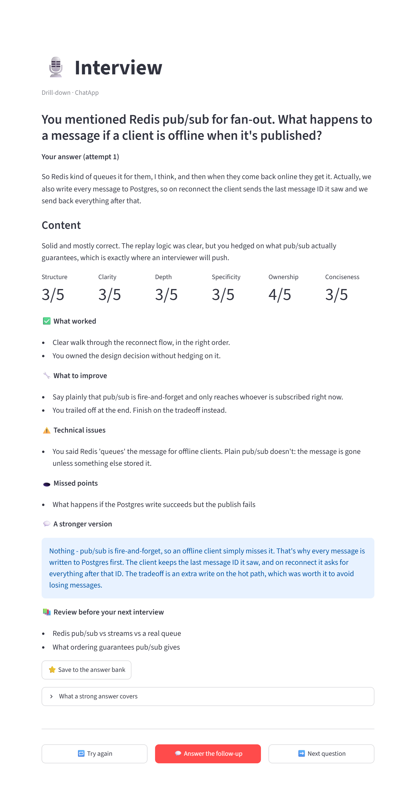
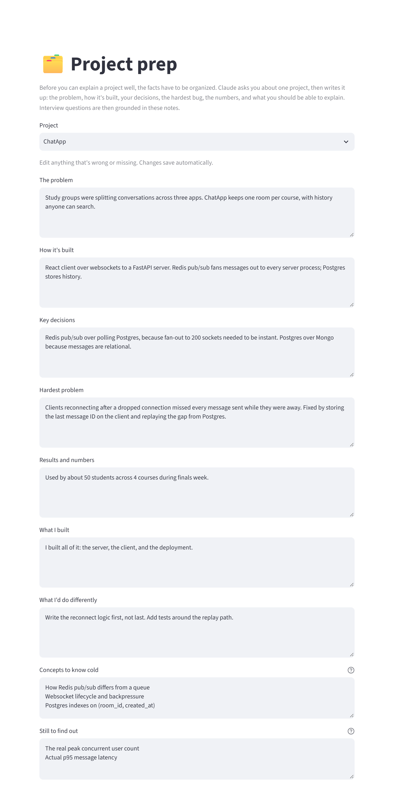
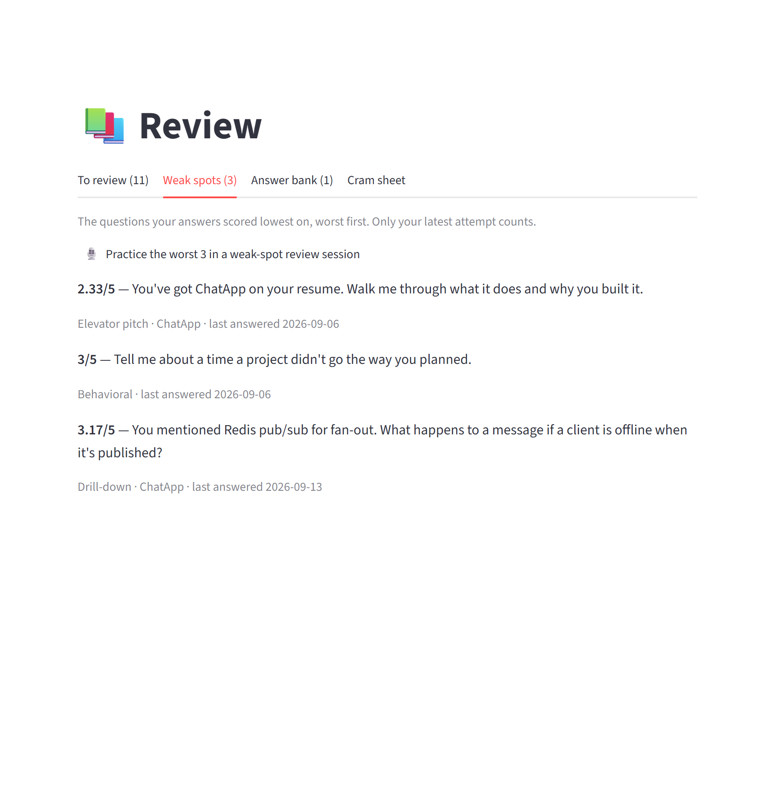
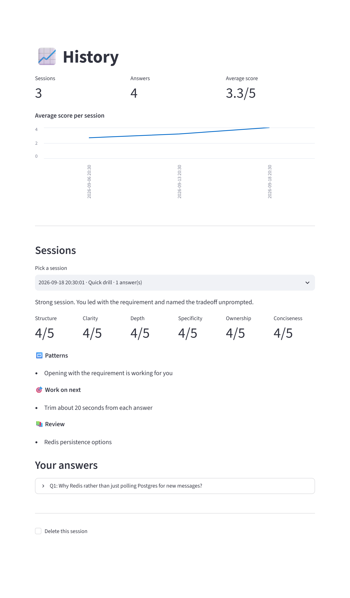

# Interviewer

Interview practice built on your own material. It runs a full interview — resume walkthrough, behavioral
questions, motivation, curveballs, technical questions about your projects, and your questions for them —
grades each answer, and presses on anything you leave open.

It runs on your machine and talks to the Claude API. Nothing is hosted.



## What it covers

Fourteen question types, drawn from your resume, background and projects:

- **Resume and story**: tell me about yourself, walk me through your resume
- **Behavioral**: conflict, failure, leadership, tight deadlines, learning something fast, in STAR shape
- **Motivation and curveballs**: why this role, weaknesses, what's not on the resume
- **Your questions for them**: practice the end of the interview, not just the middle
- **Projects, in depth**: the 30-second pitch, drill-downs into one component, why you chose X over Y, the
  hardest bug, what breaks at 100x scale, explaining it to a non-engineer, concept checks on the tech you
  listed, what you personally built, and what you'd do differently

Every answer is scored on structure, clarity, technical depth, specificity, ownership and conciseness, with
what worked, what to tighten, any technical errors, and a stronger version written in your own words with
`[placeholder]` wherever a fact is missing. Follow-up questions build on what you just said, so a thin answer
gets probed the way it would be in the room.

Spoken answers also get delivery feedback the model isn't involved in: speaking pace, filler words, and any
pause over three seconds, with the words you said right before it.

## Setup

You need Python 3.12 or newer and an [Anthropic API key](https://console.anthropic.com). Note that the API is
pay-as-you-go and separate from a Claude Pro or Max subscription: the subscription gets you nothing here, the
API account needs its own credit.

Make a `.env` file next to `app.py` (`copy .env.example .env`) with the key in it:

```
ANTHROPIC_API_KEY=sk-ant-...
```

On Windows, double-click `run.bat`. The first run builds the virtual environment and installs everything,
which takes a few minutes, then it starts the app and opens a browser tab. After that it just starts.
On macOS and Linux, `./run.sh` does the same thing. To do it by hand:

```bash
python -m venv .venv
source .venv/bin/activate       # Windows: .venv\Scripts\activate
pip install -r requirements.txt
streamlit run app.py            # then open http://localhost:8501
```

## How you use it

**Profile.** Upload a resume as a PDF or paste the text, then add your projects and background. One button
reads the resume and pulls out the projects it finds. A project can also point at its GitHub repo or a folder
on disk, and the app reads the README and main source files, so technical questions land on the code you
actually wrote rather than on the buzzwords in your stack.

**Project prep.** Ten quick questions per project, nothing graded, which produce a written brief: the problem,
the architecture, the decisions and the alternatives, the hardest bug, the numbers, what you'd change, and the
concepts an interviewer could reasonably ask you to explain. Later questions are grounded in this brief, and
it doubles as the thing to reread before the real interview.



**Interview.** Six modes: free practice, a three-question drill, a deep dive on one project, a full mock
interview (feedback held until the end, like the real thing), a drill aimed at a job posting you paste in, and
a weak-spot session that re-asks whatever scored lowest. The interviewer can be friendly, neutral or
skeptical; skeptical pushes back on unsupported claims and is the better rehearsal.

**Review and history.** Study topics accumulate in one list, with repeats sorted to the top. Low-scoring
questions queue up for another attempt, and when you redo one it shows the old score beside the new one.
Answers worth keeping go in an answer bank, and the cram sheet pulls it together for the ten minutes before an
interview: which project to lead with, which story fits which question, what to brush up on, and what to ask
them.




## Cost and privacy

The profile is cached between calls, so a session costs cents rather than dollars. Setting
`INTERVIEWER_MODEL=claude-sonnet-5` in `.env` makes it cheaper again.

Speech-to-text runs locally through [faster-whisper](https://github.com/SYSTRAN/faster-whisper), so recordings
never leave the machine; only the transcript text goes to the API. The first recording downloads the model,
about 500 MB, which takes a minute. After that a one-minute answer takes 20-30 seconds to transcribe on a
normal CPU, and `WHISPER_MODEL=base.en` in `.env` makes that faster.

Everything else lives in `data/`: the profile, the recordings, and a SQLite file with every session. That
folder and `.env` are gitignored, and the app only listens on localhost.

## Rough edges

Reading questions aloud uses the system voice, which needs `espeak` on Linux and sounds like a robot
everywhere. The filler-word counting depends on Whisper transcribing "um", which it does most of the time but
not always. The screenshots above use a sample profile rather than real data.

[OUTLINE.md](OUTLINE.md) has the original plan and the reasoning behind it.

## License

MIT. See [LICENSE](LICENSE).
